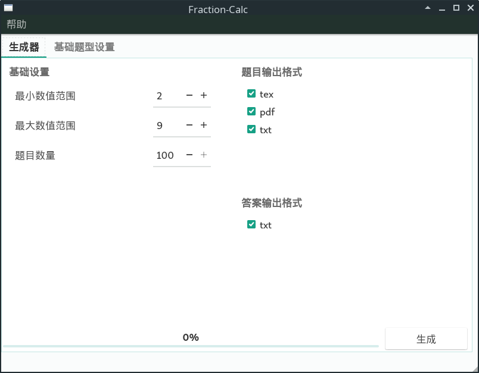
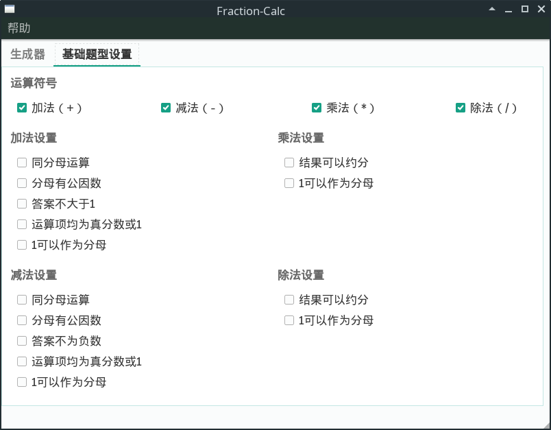
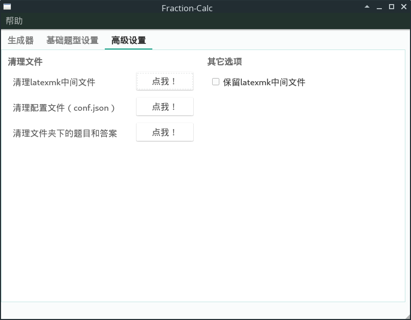

# fraction-calc
## 简介
使用PyQt5制作的分数练习题生成器。

## 发布文件

本程序使用PyInstaller打包，生成的文件较大（50MB左右），无需配置环境即可运行软件。如果你已经安装了 Python3.6+ 和 PyQt5，那么可以直接下载源代码运行。

## 更新说明

### 2019.08.23 V1.0

* [x] 增加“高级设置”面板，可以执行一些额外的操作
* [x] 增加在特定情况下禁用一些用户可调选项（例如规则有冲突）
* [x] 进度条可以使用了
* [x] 放出了一个正式版

### 2019.07.25 V0.3

* [x] 加入了四则运算的各项设置
* [x] 放出了一个预览版

### 2019.07.21 V0.2

* [x] 加入了四则运算

### 2019.07.20 V0.1

* [x] 发布初版fraction-calc
